# GroAcademy

## Identitas Diri

-   **Nama:** Muhammad Kinan Arkansyaddad
-   **NIM:** 13523152

---

## Cara Menjalankan Aplikasi

1. **Clone repositori ini**

    ```bash
    git clone https://github.com/[username]/GroAcademy.git
    cd GroAcademy
    ```

2. **Jalankan dengan Docker Compose**

    ```bash
    docker-compose up --build
    ```

    Ini akan menjalankan:

    - `app` → Web App
    - `db` → DB PostgreSQL

3. **Akses aplikasi**
    - API: [http://localhost:8080/api](http://localhost:8080/api)
    - Frontend: [http://localhost:8080](http://localhost:8080)

```
Jika membutuhkan akun admin untuk FE Admin, silakan gunakan:
Username: Prince Emory Beahan
Password: password123
```

---

## Design Pattern yang Digunakan

-   **Chain of Responsibility:** Design pattern ini digunakan pada middlewares karena Chain of Responsibility memungkinkan middleware diproses berurutan dan fleksibel, sehingga tiap lapisan/rantai dapat menangani, memodifikasi, atau meneruskan request/response tanpa saling bergantung.

-   **Factory Method:** Design pattern ini digunakan pada instansiasi Repository, Service, dan Controller Layer karena design pattern ini menyembunyikan detail pembuatan struct di dalam satu fungsi khusus.

-   **Dependency Injection Pattern:** Design pattern ini digunakan pada instansiasi Repository, Service, dan Controller Layer karena memungkinkan setiap komponen menerima dependensi dari luar, sehingga kode menjadi loose coupled, lebih mudah di-test, dan fleksibel untuk mengganti implementasi tanpa mengubah logika internal komponen tersebut.

-   **Repository Pattern:** Repository Pattern digunakan untuk memisahkan logika akses data dari bisnis logic, sehingga service atau controller dapat berinteraksi dengan data melalui interface tanpa tergantung langsung pada implementasi database.

---

## Tech Stack

-   **Bahasa Pemrograman:** Go 1.25
-   **Framework:** Gin Gonic v1.10.1
-   **Database:** PostgreSQL 17 (via Docker)
-   **Template Engine:** Go `html/template`
-   **Tools:** Docker, Docker Compose, Git, JWT, GORM ORM

---

## Endpoint

### Auth

-   `POST /api/auth/register` → Register user baru
-   `POST /api/auth/login` → Login user, dapatkan JWT token
-   `GET /api/auth/self` → Ambil data user yang sedang login

### Course

-   `GET /api/courses` → Ambil semua course
-   `POST /api/courses` → Tambah course (admin only)
-   `GET /api/courses/:id` → Detail course
-   `PUT /api/courses/:id` → Edit course (admin only)
-   `DELETE /api/courses/:id` → Hapus course (admin only)
-   `POST /api/courses/:id/buy` → Beli course
-   `GET /api/courses/my-courses` → Lihat course yang sudah dibeli

### Module

-   `POST /api/courses/:id/modules` → Tambah module ke course
-   `GET /api/courses/:id/modules` → Ambil module di course dengan id tertentu
-   `GET /api/modules/:id` → Ambil module dengan id tertentu
-   `PUT /api/modules/:id` → Edit module dengan id tertentu
-   `DELETE /api/modules/:id` → Hapus module dengan id tertentu
-   `PATCH /api/modules/:id/complete` → Menandakan module selesai
-   `PATCH /api/courses/:id/modules/reorder` → Reorder module dalam course

### User (admin only)

-   `GET /api/users` → Ambil semua user
-   `GET /api/users/:id` → Ambil user dengan id tertentu
-   `PUT /api/users/:id` → Edit user dengan id tertentu (Admin tidak bisa diedit)
-   `DELETE /api/users/:id` → Hapus user dengan id tertentu (Admin tidak bisa dihapus)
-   `POST /api/users/:id/balance` → Top up balance user

---

## Screenshot Aplikasi

-   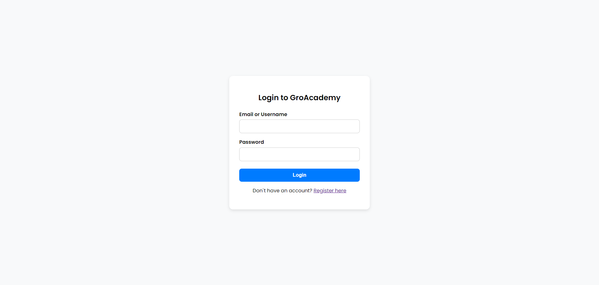
-   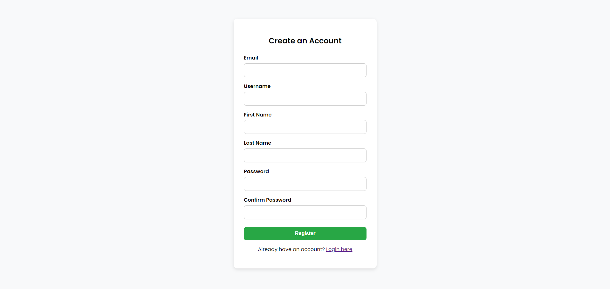
-   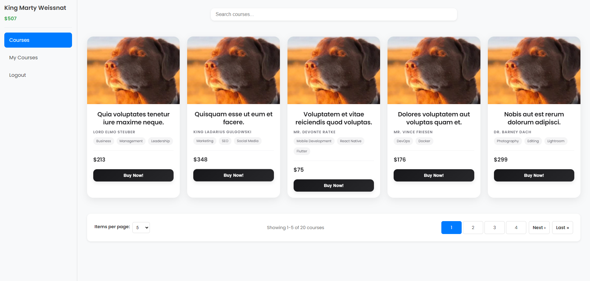
-   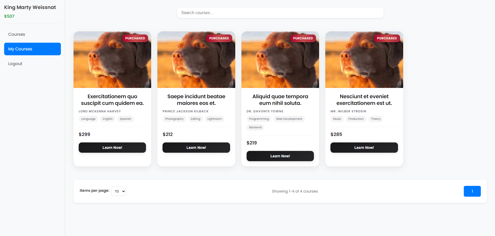
-   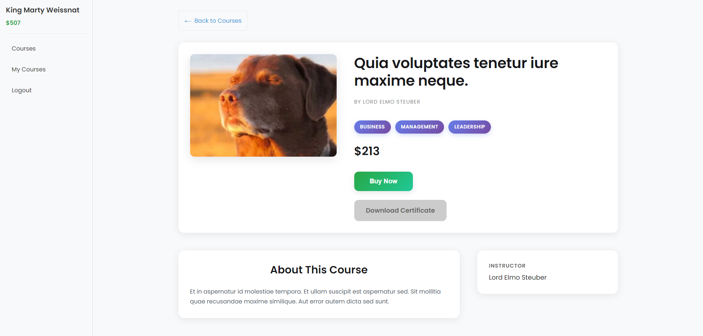
-   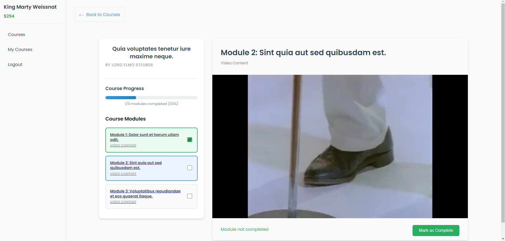
-   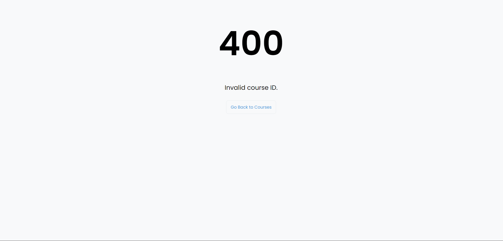

---

## Bonus

-   ### B02: Deployment: https://groacademy-production.up.railway.app/
-   ### B06: Responsive Layout
    - 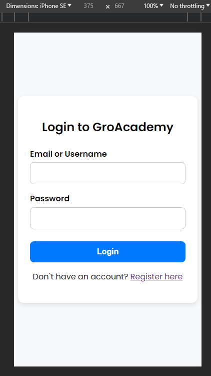
    - 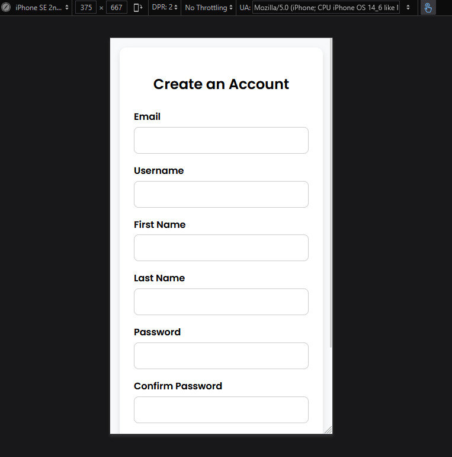
    - 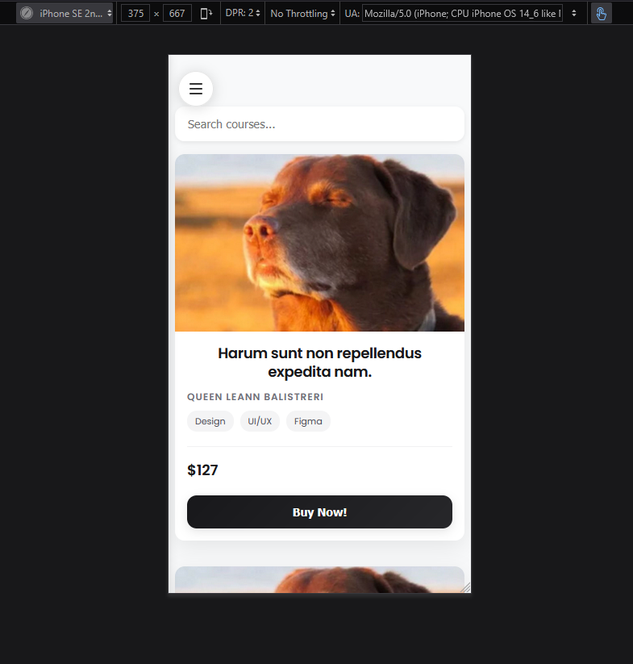
    - 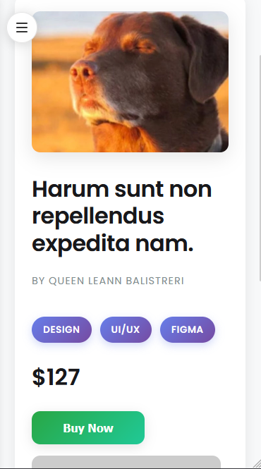
    - 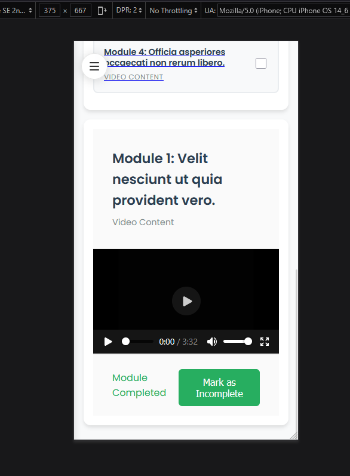